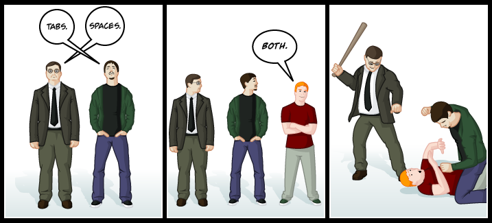

# PEP 8 - Part 1: Code Lay-out
An introduction to the Python Style Guide

---

# What is a "PEP"?

PEP stands for **"Python Enhancement Proposal"**.

That sounds pretty straightforward but it's actually a little misleading. A more detailed explanation can be found in [PEP 1 (PEP Purpose and Guidelines)](https://www.python.org/dev/peps/pep-0001/):

> A PEP is a design document providing information to the Python community, or describing a new feature for Python or its processes or environment. The PEP should provide a concise technical specification of the feature and a rationale for the feature.

A PEP doesn't necessarily have to be an "Enhancement Proposal" in the technical sense. A PEP could just as easily be an informative document to "Enhance" the Python community as a whole.

Some useful PEPs to check out:

1. [PEP 0](https://www.python.org/dev/peps/) - Index of Python Enhancement Proposals
2. [PEP 1](https://www.python.org/dev/peps/pep-0001/) - PEP Purpose and Guidelines
3. [PEP 20](https://www.python.org/dev/peps/pep-0020/) - The Zen of Python (Goals for writing "Pythonic" code)

---

# So what is PEP 8?

PEP 8 is the **"Style Guide for Python Code"**.

> One of Guido's key insights is that code is read much more often than it is written. The guidelines provided here are intended to improve the readability of code and make it consistent across the wide spectrum of Python code. As PEP 20 says, "Readability counts".

---

# So what is PEP 8?

Recommendations from PEP 8 are just that - recommendations. Many developers choose to abide by some and ignore/stretch others. The overall goal of PEP 8 is to make your code more readable and easier to maintain.

---
# What we'll cover in Part 1

In the first part of this PEP 8 presentation, we'll be covering the following sections:

# Code lay-out
- Indentation
- Tabs or Spaces?
- Maximum Line Length
- Blank Lines
- Imports

---

# Indentation: 4 Spaces

White space is very important to Python. It is literally a part of Python's syntax.

# Bad Style: Valid Syntax
    !python
    if True == True:
            print("Yep, it's true")

    def my_silly_print():
      print("Fear the Nightman")

    print(
    "I am printing"
    " several "
    " things."
    )

To make your indentation style more readable, **use 4 spaces per indentation level**.

# Good Style - Valid Syntax
    !python
    def a_little_function():
        if True:
            print("Consistency is key!")
        else:
            print("Wow... something really went wrong")

---

# Indentation: Continuation lines

Python implicitly joins lines inside parentheses, brackets, and braces. We generally indent these to match vertically:

    !python
    my_list = ["Sweet Dee",
               "looks like",
               "a bird"]

You can also do "hanging indents". With hanging indents there should be no argument on the first line and the contents should be further indented:

    !python
    my_list = [
        "Dayman",
        "fighter of",
        "the Nightman",
    ]

---

# Indentation: Hanging Function Definitions

Function definitions & conditional logic adds a bit of complexity to our indentation. Here's an example of a function definition using the hanging indents:

# Bad Style

    !python
    def an_example_function(
        a_variable,
        another_variable):
        print(a_variable, another_variable)

It's hard to tell where the definition ends and the function's body begins. In this situation, it's better to further indent or align the parameters vertically

# Good Style

    !python
    def an_example_function(
            a_variable,
            another_variable):
        print(a_variable, another_variable)

# Good Style

    !python
    def an_example_function(a_variable,
                            another_variable):
        print(a_variable, another_variable)

---

# Indentation: Conditional Logic

Just like the function definitions, we can run into the same situations however PEP 8 doesn't take an explicit position on the visual distinguishability of this.

    !python
    if (True and
        True):
        print("Something is True")

    if (True and
        True):
        # True is True
        print("Something is True")

    if (True
            and True):
        print("Something is True")

All 3 of those examples are considered "Good Style" as far as PEP 8 is concerned however some "Linters" will complain about the first two... And they should. That's hard to read.

---

# Intentation: Closing ")", "]", and "}"

The closing ")", "]", or "}" can vertically line up with the first non-whitespace character of the previous line or it can be vertically lined up with the first line that started the construct.

# Matching first non-whitespace of previous line

    !python
    test_list = [
        1,
        2,
        3,
        ]

# Matching the first line of the construct

    !python
    test_list = [
        1,
        2,
        3,
    ]

---

# Tabs or Spaces?

Spaces are preferred over Tabs. It is appropriate to use tabs to remain consistent in a project that has already been indented with tabs.

# Note
Python 3 does not allow the mixing of tabs and spaces for indentation

---

# Maximum Line Length

All lines should be under 80 characters (non-inclusive: 79 characters or fewer). This makes it easier to place multiple editors/terminals side-by-side and eliminates the need for painful/confusing line-wrapping in some editors.

Lines that contain few/no structural restrictions (docstrings, comments, etc...) should be limited to 72 characters. Most plain text documents conform to 72 characters per line traditionally (holdover from the typewriter days). Docstrings & comments can be used in non-code contexts so conforming to this standard convention makes sense.

A lot of people/teams choose to stretch the normal 80 character restriction to 100 characters. If this can be agreed upon by the team, it is acceptable as long as docstrings & comments are still 72 characters.

---

# Where to wrap

The previously mentioned indentation/line-wrap methods are preferred for operations using Python's implied line continuation (inside parens, brackets, and braces). Some operations (with) do not support that implied line continuation. In those situations, we can use backslashes:

    !python
    with open("/path/to/file1") as file1, \
         open("/path/to/file2") as file2,:
        print(file1.read())
        print(file2.read())

If you are breaking around a binary operator, it is preferred to break **after** the operator:

# Bad Style

    !python
    if (True
            and True):
        print("True")

# Good Style

    !python
    if (True and
            True):
        print("True")
    

---

# Blank Lines

Top-level function and class definitions should be separated by two blank lines aside from the last definition. Your file should not end with blank lines.

Method definitions (member functions) inside a class should be separated by a single blank line.

    !python
    import sys

    class HelloWelcomer(object):

        def __init__(self, name):
            if not name:
                print("Please provide a name")
                sys.exit(1)
            self.name = name

        def print_hello(self):
            print("Hello %s!" % self.name)

    def main():
        welcomer = HelloWelcomer("Nathan")
        welcomer.print_hello()

---

# Imports

Regular imports should be on separate lines:

# Bad Style

    !python
    import sys, os

# Good Style

    !python
    import sys
    import os

When importing multiple things from a package/subpackage, it is acceptable to place these on one line:

    !python
    from os import getgid, getuid

Imports should always be at the top of your file (below module comments & docstrings) and grouped in the following order:

1. Standard Library (os, sys, etc...)
2. Third Party modules (requests, django, etc...)
3. Local application

---

# Imports: Absolute & Relative

Absolute imports are preferred:

    !python
    from mypkg import sibling
    from mypkg.sibling import example

Explicit relative imports are acceptable in situations where complex package layouts would make absolute imports difficult or unnecessarily verbose:

    !python
    from . import sibling
    from .sibling import example

Absolute imports should always be used for standard library code.

---

# Imports: Wildcards

Wildcard imports should be avoided since these can cause namespace collisions & decrease readability.

# Bad Style

    !python
    from os import *
    print(getuid())

# Good Style

    !python
    import os
    print(os.getuid())

---

# Questions?
